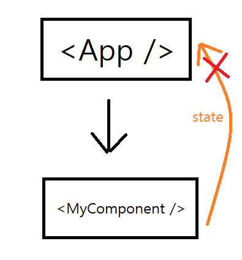
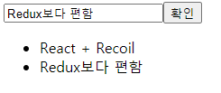

# 상태관리 ?

 React에서 말하는 상태관리는 함수형 컴포넌트에서는 **useState**를 클래스형 컴포넌트에서는 **state**로 주로 생각할 것입니다. 하지만 이러한 상태관리는 컴포넌트에 붙어있기 때문에 어플리케이션이 커지다 보면 유지보수하기 어려울 것입니다. 예를 들면 **MyComponent**라는 컴포넌트가 있다고 합시다.  **MyComponent**에서 댓글을 달아 **state**가 변경된다면 부모 컴포넌트인 **App** 컴포넌트에서는 그 댓글을 사용할 수 없습니다.



 이러한 현상을 막기 위해 전역적으로 상태관리가 필요했고 그에 따른 상태관리 라이브러리가 많이 존재합니다.

**Redux**와 **MobX, React Context** 등이 대표적일 것 같습니다.

필자는 **Redux**를 주로 사용했습니다.

**Redux**를 사용해본 사람들은 알겠지만 액션,리듀서,스토어 등 필요로 하는 기본 소스들이 너무 많습니다.

한번 적용하려면 **'Redux 써야하나..?? 번거롭다...'** 이런 생각을 많이 했습니다.

그러다가 필자는 **Recoil**을 접했고 상태관리에 혁신을 느꼈습니다.

# Recoil ?

 **Recoil**은 페이스북에서 내놓은 상태관리 라이브러리입니다.

**atom**이라는 State 단위를 사용하며 컴포넌트가 **atom**을 구독하고 변경된 내역은 구독한 컴포넌트만 재렌더링 된다고합니다.

이러한 방식으로 기존 Redux에서 보던 액션이니.. 스토어니.. 이런게 싹다 필요없게 됐습니다. 

**useState Hooks**와 비슷하게 전역 상태 관리를 할 수 있게 됐습니다.

## RecoilRoot

```jsx
function Root() {
	return (
		<RecoilRoot>
		      <App />
		</RecoilRoot>
	)
}
```

 **RecoilRoot**로 최상위 컴포넌트를 감싸줍니다. Redux에서 보던 Providor와 유사합니다.

## Atom

```jsx
const textState = atom({
  key: 'textState', // unique ID (with respect to other atoms/selectors)
  default: '', // default value (aka initial value)
});
```

 공식 문서에서 가져온 **atom** 형식입니다. 

```jsx
 const [text, setText] = useRecoilState(textState);
```

 위 처럼 **atom**을 선언한 후 **useRecoilState**로 가져와 기존 Hooks인 **useState**처럼 똑같이 사용할 수 있습니다.

## Selector

```jsx
const recoilData = selector({
  key: 'recoilData', // unique ID (with respect to other atoms/selectors)
  get: ({get}) => {
    const text = get(textState);
    return `가져온 값의 길이는 ${text.length} 가져온 값은 ${text}입니다.`;
  },
});

const data = useRecoilValue(recoilData);
```

 **selector**를 사용하여 **atom** 내 값을 가져와 변형을 주고 다시 반환하였습니다.

**useRecoilValue**를 사용하여 **Getter**로 사용한 모습입니다.

```jsx
const setText = useSetRecoilState(textState)
```

 **useSetRecoilState** 함수로는 **Setter**만 가져올 수 있습니다.

# 실전! Todo List 적용

 간단한 Recoil을 사용하기 위해 Todo List에 일정을 Recoil로 관리해 보겠습니다.

```bash
> yarn create react-app recoil-todo
> yarn add recoil
```

프로젝트를 먼저 생성해주겠습니다.

```jsx
import React from 'react';
import ReactDOM from 'react-dom';
import App from './App';
import { RecoilRoot } from 'recoil';

ReactDOM.render(
  <RecoilRoot>
    <App />
  </RecoilRoot>,
  document.getElementById('root')
);

// src/index.js
```

recoil을 사용하기 위해 index.js에서 최상위 컴포넌트에 **RecoilRoot**를 씌어줍니다.

```jsx
import React from 'react';
import { atom, selector } from 'recoil';

export const todoState = atom({
	key: 'todoState',
	default: [],
});

export const todoGetter = selector({
	key: 'todoGetter',
	get: ({get}) => {
		return get(todoState);
	}
})
	
// src/atoms.js
```

src 폴더에 atoms.js를 생성하고 **todoState**를 관리할 **atom**을 선언해줍니다.

그 다음 todo 리스트가 들어갈 배열을 default 값에 잡아줬습니다.

todo 배열을 읽기만 하는 **todoGetter**로 **selector**로 만들어주었습니다.

```jsx
import React, {useState} from 'react';
import {
  useRecoilState,
  useRecoilValue,
} from 'recoil';
import { todoState } from './atoms';

...
function TodoInput() {
	const [Text,SetText] = useState('');
	const [todoArr, SetTodo] = useRecoilState(todoState);
	
	return (
		<>
			<input type="text" placeholder="일정 입력" onChange={(e) => SetText(e.target.value)} value={Text} />
			<button onClick={()=>SetTodo(todoArr.concat(Text))}>확인</button>
		</>
	)
}
...

// src/App.js
```

그 다음 App.js에서 일정을 입력할 input tag와 button을 준비합니다.

**useRecoilState**로 atoms.js에서 선언한 todoState 가져옵니다. 그럼 useState와 똑같이 사용하시면 됩니다. 위 소스에선 input값이 들어가 있는 Text 변수를 todoArr에 이어주었습니다.

```jsx
...
import { todoState, todoGetter } from './atoms';
...

...
function TodoView() {
	const todoArr = useRecoilValue(todoGetter);

	return (
		<ul>
			{todoArr.map((v,i) => <li key={`todoArr-${i}`}>{v}</li>)}
		</ul>
	)
}
...

// src/App.js
```

Todo List를 출력할 컴포넌트도 하나 만들어줍시다.

이번엔 출력만 하면 되니 아까 **selector**로 만들어준 **todoGetter**를 **useRecoilValue**로 불러와줍니다.

그러면 **todoArr** 변수에  **TodoInput** 컴포넌트에서 Text를 추가한 값들이 들어가있습니다.

```jsx
import React, {useState} from 'react';
import {
  useRecoilState,
  useRecoilValue,
} from 'recoil';
import { todoState, todoGetter } from './atoms';

function TodoInput() {
	const [Text,SetText] = useState('');
	const [todoArr, SetTodo] = useRecoilState(todoState);
	
	return (
		<>
			<input type="text" placeholder="일정 입력" onChange={(e) => SetText(e.target.value)} value={Text} />
			<button onClick={()=>SetTodo(todoArr.concat(Text))}>확인</button>
		</>
	)
}

function TodoView() {
	const todoArr = useRecoilValue(todoGetter);

	return (
		<ul>
			{todoArr.map((v,i) => <li key={`todoArr-${i}`}>{v}</li>)}
		</ul>
	)
}

function App() {
  return (
    <div>
		<TodoInput />
		<TodoView />
    </div>
  );
}

export default App;

// src/App.js
```

 위에서 만들었던 컴포넌트를 적용한 App.js 완성 소스입니다.

## 결과



**TodoInput ,TodoView** 컴포넌트가 **recoil**를 통해 서로 상태를 공유하는 모습을 볼 수 있습니다.

이처럼 **recoil**은 **useState** 사용하는 것 처럼 전역 상태를 관리합니다.

Redux나 MobX를 사용하신 분은 상태 관리 소스가 훨씬 줄어든 것을 확연하게 체감하실겁니다.

~~**필자는 recoil을 써보고 줄어든 소스에 여태까지 고생이 떠오르며 눈물 두방울을 흘렸습니다....😭**~~
